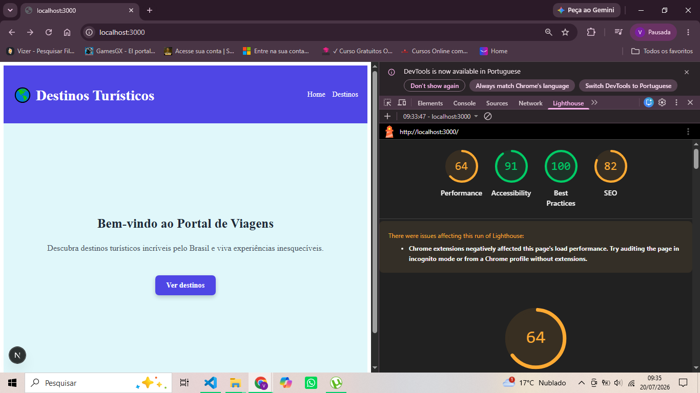
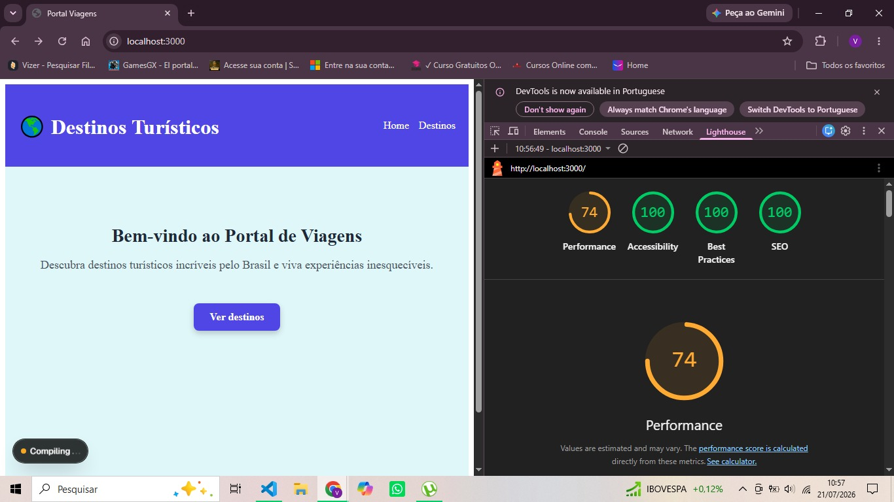
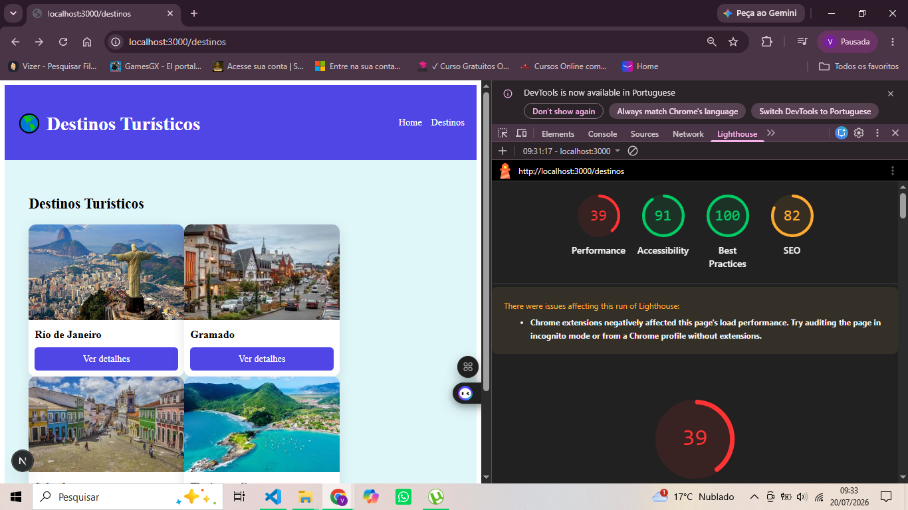
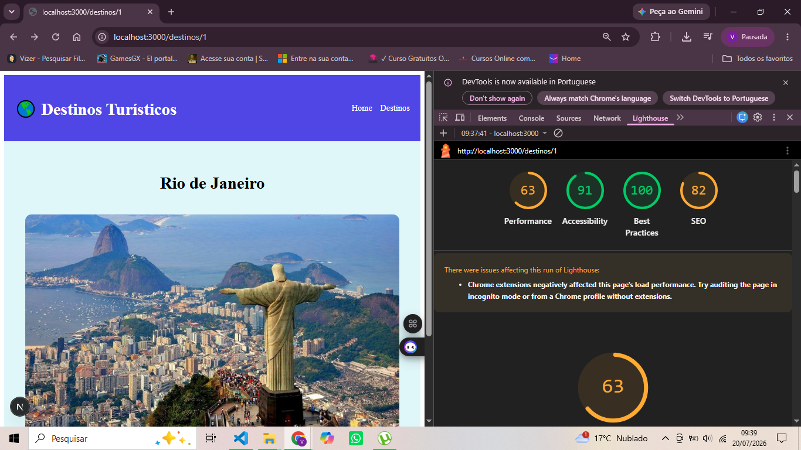
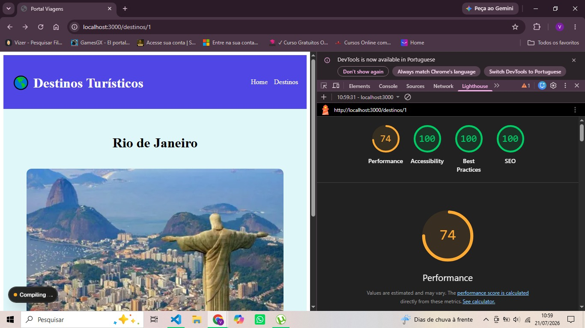

# 🌍 Portal Viagens

## 📌 Descrição

O **Portal Viagens** é uma aplicação desenvolvida com **Next.js** que apresenta destinos turísticos brasileiros. O objetivo do projeto é permitir que os usuários conheçam diferentes destinos, visualizem imagens e acessem informações sobre cada local de forma simples e intuitiva.

Nesta atividade foi realizada uma análise de performance utilizando o **Google Lighthouse**, identificando gargalos e aplicando técnicas de otimização para melhorar o carregamento da aplicação e a experiência do usuário.

---

## 🎯 Objetivo da atividade

Aplicar os conceitos estudados sobre otimização de performance em um projeto Front-End existente, realizando uma comparação entre o cenário inicial e os resultados obtidos após as melhorias implementadas.

---

## 🚀 Tecnologias utilizadas

- Next.js
- React
- TypeScript
- CSS Modules
- Google Lighthouse
- Chrome DevTools

---

# 🔍 Gargalos identificados

Durante a análise inicial foram identificados alguns pontos que impactavam a performance da aplicação:

- Imagens em formato **.jpg**.
- Utilização da tag HTML ``.
- Ausência de otimização automática das imagens.
- Falta de metadados para SEO.
- Carregamento mais lento devido ao tamanho das imagens.

---

# ⚙️ Melhorias aplicadas

Foram realizadas as seguintes otimizações:

- Conversão das imagens de **.jpg** para **.webp**.
- Substituição da tag `` pelo componente `next/image`.
- Implementação de Lazy Loading.
- Inclusão de metadata (`title` e `description`) no `app/layout.tsx`.
- Organização dos arquivos de imagens, mantendo apenas os formatos utilizados pela aplicação.

---

# 📊 Comparação de Performance

As análises foram realizadas utilizando o **Google Lighthouse**, comparando as mesmas rotas antes e depois das otimizações.

---

# 🏠 Página Inicial (/)

| Métrica | Antes | Depois |
|---------|------:|--------:|
| Performance | **64** | **74** |
| Accessibility | **91** | **100** |
| Best Practices | **100** | **100** |
| SEO | **82** | **100** |

## 📷 Antes das otimizações



## 📷 Depois das otimizações



---

# 🧳 Página Destinos (/destinos)

| Métrica | Antes | Depois |
|---------|------:|--------:|
| Performance | **39** | **52** |
| Accessibility | **91** | **100** |
| Best Practices | **100** | **100** |
| SEO | **82** | **100** |

## 📷 Antes das otimizações



## 📷 Depois das otimizações


---

# 🏖️ Página Detalhes (/destinos/1)

| Métrica | Antes | Depois |
|---------|------:|--------:|
| Performance | **63** | **74** |
| Accessibility | **91** | **100** |
| Best Practices | **100** | **100** |
| SEO | **82** | **100** |

## 📷 Antes das otimizações



## 📷 Depois das otimizações



---

# 📈 Resumo dos resultados

Após as otimizações foi possível observar melhorias importantes em diferentes páginas da aplicação.

Principais ganhos obtidos:

- Conversão das imagens para o formato **WebP**, reduzindo o tamanho dos arquivos.
- Utilização do componente **next/image**, permitindo otimizações automáticas do Next.js.
- Implementação de **Lazy Loading**, carregando imagens apenas quando necessário.
- Configuração de **metadata**, elevando a pontuação de SEO para 100 em todas as páginas analisadas.
- Melhoria nas métricas de Accessibility em todas as páginas.

Na página de detalhes (`/destinos/1`) houve uma pequena variação na pontuação de Performance (63 para 62), comportamento comum em medições do Lighthouse, que podem sofrer pequenas oscilações entre execuções. Apesar disso, as demais métricas permaneceram melhores ou iguais após as otimizações implementadas.

---

# 📂 Estrutura do projeto

```text
portal-viagens/
│
├── app/
├── components/
├── data/
├── public/
├── relatorios/
│   ├── Antes-Pagina_Inicial.png
│   ├── Depois-Pagina_Inicial.png
│   ├── Antes-Pagina_Destinos.png
│   ├── Depois-Pagina_Destinos.png
│   ├── Antes-Pagina_Destinos_1.png
│   └── Depois-Pagina_Destinos_1.png
│
├── styles/
├── README.md
├── package.json
└── tsconfig.json
```

---

# ▶️ Como executar o projeto

Clone o repositório:

```bash
git clone https://github.com/vinidev05/Portal-Viagens-Otimizado.git
```

Instale as dependências:

```bash
npm install
```

Execute o projeto:

```bash
npm run dev
```

Ou execute a versão de produção:

```bash
npm run build
npm run start
```

---

# ✅ Conclusão

A atividade permitiu aplicar na prática técnicas de otimização de performance utilizando recursos nativos do Next.js.

As melhorias implementadas proporcionaram uma aplicação mais otimizada, com imagens mais leves, melhor carregamento, aumento da pontuação de SEO e melhorias de acessibilidade.

Os resultados obtidos através do Lighthouse demonstram que pequenas alterações na forma de carregar imagens e organizar a aplicação podem gerar impactos positivos na experiência do usuário.

---

## 👨‍💻 Autor

**Vinícius Eduardo**

Projeto desenvolvido como atividade prática do curso **Desenvolvedor Full Stack Python** da **EBAC**.